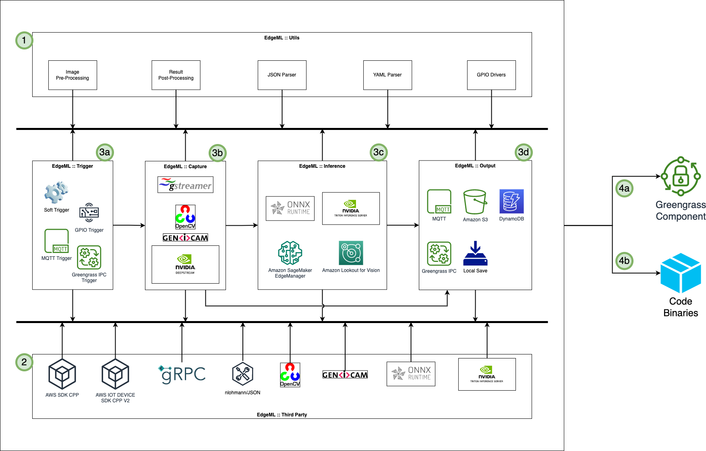

# Edge ML Accelerator

- Build Status::
    |                   | **Ubuntu 18/20/22** |   **CentOS 7/8**    |
    |-------------------|---------------------|---------------------|
    | **x86_64**        |  |  |
    | **x86_64 + CUDA** |  |  |
    | **ARM64**         |  |  |
    | **ARM64 + CUDA**  |  |  |
    ----------------------------------------------------------------------------------

Edge ML Accelerator is a C++ based, highly configurable & repeatable artifact used for deploying on any IoT edge devices and running ML models, manage interfaces like Cameras, GPIO, Output just by making required changes to config file. This is a highly configurable project for running ML Models at the Edge. The accelerator is configurable for type of camera, number of cameras, ML model framework, single/parallel ML models and output requirements.

## Edge ML Accelerator Architecture:


## How does it work:
Edge ML Accelerator comprises of multiple plugins that interact with each other in a dedicated flow. The flow can be determined by defining a `JSON` or `YAML` config file. Based on the flow, the Trigger API, Camera API, Inference API, and Output API are executed. The overall flow is asynchronous and structured so none of the APIs run into race conditions.
- The flow is as follows:
    - 1 `edgeml :: utils` are used for general utility tasks like image pre-processing, result post-processing, json/yaml parser and GPIO interfacing
    - 2 `edgeml :: third party` are the dependencies which are used to carry out the tasks and run the different plugins
    - 3 `edgeml ::`:
        - (a) `edgeml :: trigger` is used to define how the pipeline will be triggered using different techniques
        - (b) `edgeml :: capture` is used to determine which API to use to capture image from video, image, USB camera or IP camera
        - (c) `edgeml :: inference` is used to run inference on the captured image using different ML model frameworks
        - (d) `edgeml :: output` is used to direct the output results into various sinks
    - 4 Usage:
        - (a) Using AWS IoT Greengrass V2 to deploy and run component on the edge device
        - (b) Simply run the binaries on the edge device

## BUILD:
- In order to build the binaries:
```
$ cd {Edge ML Accelerator Project Directory}
$ bash buildscripts/localbuild.sh -{flags}
```
- How to use the {flags}:
    ----------------------------------------------------------------------------------
    |                        | **sudo** | **Skip Updates** | **sudo + Skip Updates** |
    |------------------------|----------|------------------|-------------------------|
    | **EdgeML + 3rd Party** |     s    |         o        |          os/so          |
    | **EdgeML Only**        |   es/es  |       oe/oe      | eos/eso/ose/oes/seo/soe |
    ----------------------------------------------------------------------------------

### CMake Flags for different settings:
#### Unit Tests:
- `$ cmake flags: -DCMAKE_BUILD_TESTS=ON/OFF`
- To build and test out the different modes
#### Build with Pylon Capture:
- `$ cmake flags: -DUSE_PYLON=ON/OFF`
- To build Pylon Capture and utilize it in the other plugins
#### Build with Detailed Logging:
- `$ cmake flags: -DLOGS_LEVEL=0/1/2/3/4/5`
- To display detailed logs

## RUN:
### Setting Environment Variable: For binaries, libraries & dependencies:
```
$ export LD_LIBRARY_PATH=$LD_LIBRARY_PATH:`pwd`/package/lib
$ export PATH=$PATH:`pwd`/package/bin
```
### For GenICam:
```
$ export GENICAM_GENTL64_PATH=package/lib/rc_genicam_api
```
### For Pylon:
Assuming Pylon SDK is downloaded, untarred and saved in `/opt/pylon/`:
```
$ export PATH=$PATH:/opt/pylon/bin
$ export LD_LIBRARY_PATH=$LD_LIBRARY_PATH:/opt/pylon/lib
```
### For Config File:
```
$ export EDGE_ML_CONFIG='pwd'/examples/example_config_GENERIC.json
-OR-
$ export EDGE_ML_CONFIG='pwd'/examples/example_config_GENERIC.yml
```

### [WIP] Run All Unit Tests:
```
$ [From Main Directory]
$ export LD_LIBRARY_PATH=$LD_LIBRARY_PATH:`pwd`/package/lib
$ export PATH=$PATH:`pwd`/package/bin
$ export EDGE_ML_CONFIG=/path/to/config.json -OR- export EDGE_ML_CONFIG=/path/to/config.yml
$ ctest
```

### Run Pipeline App:
```
$ export NUMITER=5
$ cd build
$ ./package/bin/pipeline_app $NUMITER
```

## Connecting to triton server
By default the EdgeML accelerator connects to a localhost::8001 using Grpc. The system produces by default 2 inputs. One with an image of any size and 3 channels (either RGB or BGR) and and metadata input as string. For example this metadata can be and outfolder, and stringfied json, among others. The reponse must be a stringfied jsonenconding the predictions. For example, if you wish just to send the classification label or a base64 image, just put that as a json in a postprocessing part of an ensemble backend. See this to get an example for object detection and unpervised anomaly detection [Gitlab link](https://gitlab.aws.dev/proserve-es/industrial-ml/ml-recipes/simple-triton-yolo-pipeline)

## Work-In-Progress
- Adding a better way of Versioning
- Adding DynamoDB support, DeepStream support

## Dependencies:
- To build the C++ plugins, the project uses [CMake](https://cmake.org) >= 3.18.0
- The project utilizes multiple submodules and dependencies with specific versions as follows:
    - [AWS IoT Device SDK for C++ v2](https://github.com/aws/aws-iot-device-sdk-cpp-v2) == `tags/v1.15.2`
    - [AWS SDK CPP](https://github.com/aws/aws-sdk-cpp) == `tags/1.9.253`
    - [GRPC](https://github.com/grpc/grpc) == `tags/v1.46.2`
    - [OPENCV](https://github.com/opencv/opencv) == `tags/4.6.0`
    - [RC_GENICAM](https://github.com/roboception/rc_genicam_api) == `tags/v.2.5.14`
    - [TRITON CLIENT](https://github.com/triton-inference-server/client) == `commit/3d05400`
    - [ONNXRUNTIME](https://github.com/microsoft/onnxruntime) == `tags/v1.13.1`
    - [NLOHMANN/JSON](https://github.com/nlohmann/json) == `tags/v.3.11.2`

## References:
- For Pylon, download the respective SDK from [here](https://www.baslerweb.com/en/sales-support/downloads/software-downloads/) and unzip into `/opt/pylon`.

## Contributors:
For any issues, queries, concerns, updates, requests, kindly contact:
- [Romil Shah (@rpshah)](https://phonetool.amazon.com/users/rpshah)
- [Fabian Benitez-Quiroz (@fabianbq)](https://phonetool.amazon.com/users/fabianbq)